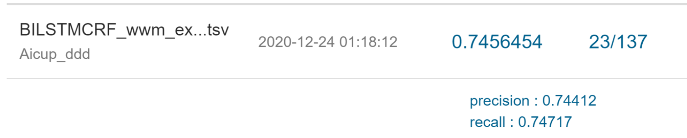

# 2020_AICUP
Name Entity Recognition in Medical Data Contest

## Requirements

```sh
pip install "kashgari>=1.1,<2.0"
pip install "tensorflow>=1.14,<2.0"
```

### Pre-trained BERT model:
- [Google BERT](./https://github.com/google-research/bert)
- [Chinese-BERT-wwm](./https://github.com/ymcui/Chinese-BERT-wwm)

### BERT Transfer Learning Framework
- [Kashgari](./https://github.com/BrikerMan/Kashgari)

---

## Data
> Data files won't be uploaded due to privacy concerns.

### Sample Training Data

### Sample Test Data

### Output Format


---

## [Name Entity Recognition Introduction](./NER_intro.ppt)


---

## Method
### Transfer Learning with pre-trained BERT and add BiLSTM + CRF layer


### Bagging the outputs of all kinds of pre-trained BERT


---

## Result on Public Leader Board
### Google BERT Batch Size 24

### Google BERT Batch Size 36

### Roberta wwm

### BERT wwm

### Bagging the outputs


---

## Reference
https://www.semanticscholar.org/paper/A-BERT-BiLSTM-CRF-Model-for-Chinese-Electronic-Zhang-Jiang/bd01b18df9a39cdd5c66f44051d62f176e9c8e7e
